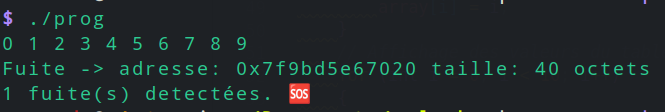
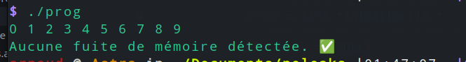

<h1 align="center">
noleaks ✅
</h1>
<p align="center">
<b><i>No memory leaks in c. Are you tempted? 😎</i></b>
</p>

## Introduction

Personally, I hate memory leaks! It's too easy a mistake, too difficult to detect and far too fatal.

That's why I've coded a small library that will detect your memory leaks. So you don't have to worry about it. 

**TOO GOOD ISN'T IT?!**

## Docs

Simple and effective you know malloc? you know free? prefix with nl and do as usual 😎.

Add a small debugging function to find out where the leaks are, and you've got the solution.
⚠️ with large memory values in multithreaded mode, some bugs have yet to be resolved
Prototype :
```c
void *nlmalloc(size_t size);
void nlfree(void *ptr);
void check_memory_leaks(void);
```

## Exemple

```c
#include "./include/noleaks.h"

int	main(void)
{
	int	*array;

	// Allocation de mémoire pour un tableau de 10 entiers
	array = (int *)nlmalloc(10 * sizeof(int));
	// Vérification si l'allocation a réussi
	if (array == NULL)
	{
		ft_printf("Erreur d'allocation de mémoire\n");
		return (1);
	}
	// Remplissage du tableau avec des valeurs
	for (int i = 0; i < 10; i++)
	{
		array[i] = i;
	}
	// Affichage des valeurs du tableau
	for (int i = 0; i < 10; i++)
	{
		ft_printf("%d ", array[i]);
	}
	ft_printf("\n");
	// Libération de la mémoire allouée
	// nlfree(array);
	// (Optionnel) Vérification des fuites de mémoire à la fin du programme
	check_memory_leaks();
	return (0);
}
```
result:



if you uncomment "nlfree()".



## Usage

```shell
git clone git@github.com:arnaudderison/noleaks.git noleaks
```

OR

```shell
git clone https://github.com/arnaudderison/noleaks.git noleaks
```

```shell
cd noleaks
make
```

### Compilation

```shell
gcc <your c file> noleaks.a -o <output file>
```
